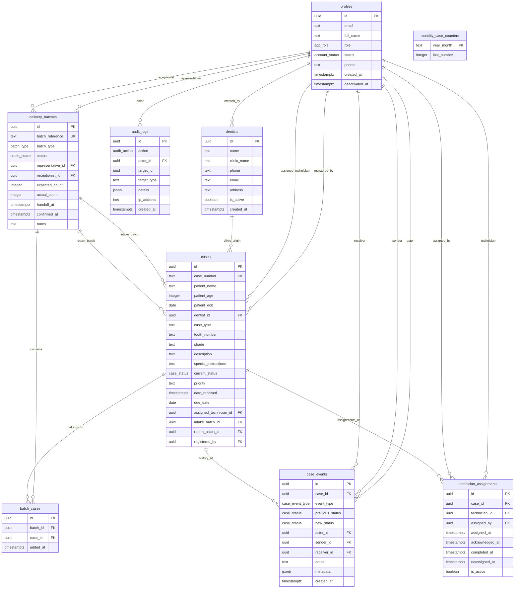

# Entity-Relationship Diagram (ERD)

```mermaid
erDiagram
    profiles ||--o{ cases : "registered_by"
    profiles ||--o{ cases : "assigned_technician"
    profiles ||--o{ delivery_batches : "representative"
    profiles ||--o{ delivery_batches : "receptionist"
    profiles ||--o{ case_events : "actor"
    profiles ||--o{ case_events : "sender"
    profiles ||--o{ case_events : "receiver"
    profiles ||--o{ technician_assignments : "technician"
    profiles ||--o{ technician_assignments : "assigned_by"
    profiles ||--o{ audit_logs : "actor"
    profiles ||--o{ dentists : "created_by"

    dentists ||--o{ cases : "clinic_origin"

    delivery_batches ||--o{ cases : "intake_batch"
    delivery_batches ||--o{ cases : "return_batch"
    delivery_batches ||--o{ batch_cases : "contains"
    cases ||--o{ batch_cases : "belongs_to"

    cases ||--o{ case_events : "history_of"
    cases ||--o{ technician_assignments : "assignments_of"

    profiles {
        uuid id PK
        text email
        text full_name
        app_role role
        account_status status
        text phone
        timestamptz created_at
        timestamptz deactivated_at
    }

    dentists {
        uuid id PK
        text name
        text clinic_name
        text phone
        text email
        text address
        boolean is_active
        timestamptz created_at
    }

    monthly_case_counters {
        text year_month PK
        integer last_number
    }

    delivery_batches {
        uuid id PK
        text batch_reference UK
        batch_type batch_type
        batch_status status
        uuid representative_id FK
        uuid receptionist_id FK
        integer expected_count
        integer actual_count
        timestamptz handoff_at
        timestamptz confirmed_at
        text notes
    }

    cases {
        uuid id PK
        text case_number UK
        text patient_name
        integer patient_age
        date patient_dob
        uuid dentist_id FK
        text case_type
        text tooth_number
        text shade
        text description
        text special_instructions
        case_status current_status
        text priority
        timestamptz date_received
        date due_date
        uuid assigned_technician_id FK
        uuid intake_batch_id FK
        uuid return_batch_id FK
        uuid registered_by FK
    }

    batch_cases {
        uuid id PK
        uuid batch_id FK
        uuid case_id FK
        timestamptz added_at
    }

    case_events {
        uuid id PK
        uuid case_id FK
        case_event_type event_type
        case_status previous_status
        case_status new_status
        uuid actor_id FK
        uuid sender_id FK
        uuid receiver_id FK
        text notes
        jsonb metadata
        timestamptz created_at
    }

    technician_assignments {
        uuid id PK
        uuid case_id FK
        uuid technician_id FK
        uuid assigned_by FK
        timestamptz assigned_at
        timestamptz acknowledged_at
        timestamptz completed_at
        timestamptz unassigned_at
        boolean is_active
    }

    audit_logs {
        uuid id PK
        audit_action action
        uuid actor_id FK
        uuid target_id
        text target_type
        jsonb details
        inet ip_address
        timestamptz created_at
    }
```
